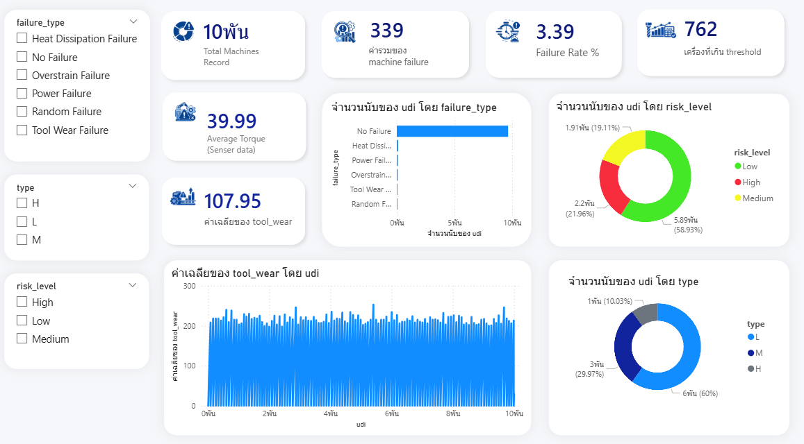
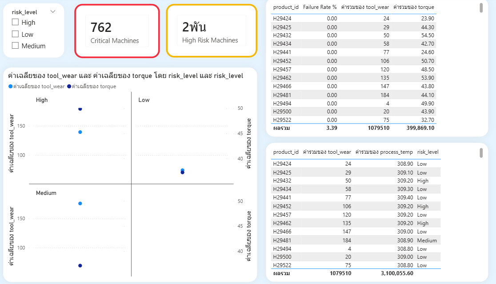

# 📊 Machine Monitoring & Alert System

## 🔹 Overview

This project is a machine monitoring and analytics dashboard designed to track equipment performance, detect failures, and identify high-risk machines.

---

## 🧠 Objectives

* Monitor machine performance using sensor data
* Identify machine failures and their types
* Classify machines into risk levels (High / Medium / Low)
* Detect critical machines that exceed threshold conditions

---

## Data Source
Simulated industrial machine sensor dataset

---

## 🛠️ Tech Stack

* **PostgreSQL** – Data storage and transformation (raw → staging → mart)
* **Power BI** – Data visualization and dashboard
* **SQL** – Data cleaning, transformation, and aggregation

---

## 🗂️ Data Pipeline Architecture

The data pipeline is designed using a layered approach:

```
Raw Layer → Staging Layer → Mart Layer
```

* **Raw**: Original sensor data (no transformation)
* **Staging**: Cleaned and validated data
* **Mart**: Aggregated data optimized for analytics

---

## 📊 Dashboard Features

### 🔸 Key KPIs

* Total Machines
* Machine Failures
* Failure Rate (%)
* Machines Above Threshold
* Average Torque
* Average Tool Wear

---

### 🔸 Analysis

* Failure Type Distribution
* Risk Level Segmentation
* Machine Type Analysis
* Sensor Trends (tool_wear, torque)

---

### 🔸 Advanced Insights

* 🔴 Critical Machines (Threshold-based)
* ⚠️ High Risk Machines
* 📋 Machine-level Detail Table

---

## 📸 Dashboard Preview

### Machine Performance Overview



### Risk & Critical Machine Analysis



---

## 🔍 Key Insights

* High tool wear strongly correlates with machine failure
* Machines with higher torque tend to have higher risk levels
* Preventive maintenance should focus on high-risk machines


---

## 🎯 Skills Demonstrated

* Data Pipeline Design (ETL)
* SQL Data Transformation
* Data Modeling (Fact / Aggregation)
* Dashboard Design (Power BI)
* Data Analysis & Insight Generation
